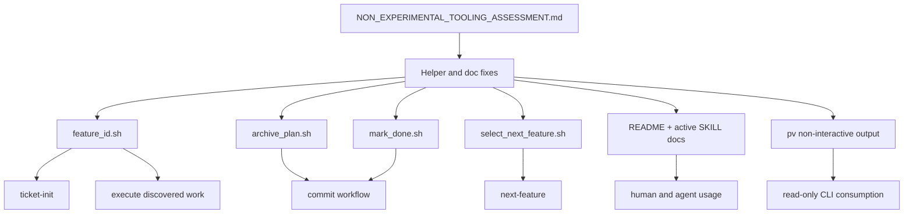

**Feature:** skill-004 -> Harden non-experimental tooling contracts

## Summary

This change hardened the repo's active tooling surface so command failures are explicit, commit-side archival is safer, `next-feature` gives more actionable blocked-work output, and the active docs match the current environment more closely.

Scope stayed limited to non-experimental tooling:
- `skills/_lib/feature_id.sh`
- `skills/_lib/select_next_feature.sh`
- `skills/commit/scripts/archive_plan.sh`
- `skills/commit/scripts/mark_done.sh`
- active workflow docs and skill wording
- non-interactive `bin/pv` output

## Implemented Changes

### Helper and script safety

- `feature_id.sh` now fails fast when the features file is missing instead of returning a false-success ID
- `archive_plan.sh` now rejects archive-path collisions instead of silently overwriting history
- `mark_done.sh` now requires the archive file to exist before writing `plan_file`

### `next-feature` contract alignment

- `select_next_feature.sh` still preserves `--id` semantics
- no-ready report mode now lists the first blocked items and their unmet dependencies
- cycle detection remains a manual inspection step; the skill prompt no longer implies that the helper resolves it automatically

### Documentation cleanup

- `README.md` now reflects multi-ticket `ticket-init`
- `README.md` now documents `sync-prompts.sh --clean` and `--silent`
- active skill docs now use repo-neutral wording instead of stale provider-specific tool names

### `pv` output

- non-interactive `bin/pv` output now suppresses ANSI color codes automatically
- interactive rendering behavior stays unchanged

## Verification

- `python3 bin/pv --help`
- `bash -n skills/_lib/feature_id.sh`
- `bash -n skills/_lib/select_next_feature.sh`
- `bash -n skills/commit/scripts/archive_plan.sh`
- `bash -n skills/commit/scripts/mark_done.sh`
- fixture checks confirmed:
  - missing-file `feature_id.sh` now exits non-zero with a clean error
  - `archive_plan.sh` now fails on collision without replacing the existing archive
  - `mark_done.sh` now fails on a missing archive path
  - `select_next_feature.sh --id` still returns the same recommendation semantics
  - no-ready report mode now shows blocked IDs and unmet dependencies
  - piped `python3 bin/pv <fixture>` output no longer contains ANSI escapes

## Notes

- The existing `tests/test_pv_creation.py` harness still fails because of its custom import path for `bin/pv`; that issue predates this feature and was left out of scope.
- `docs/NON_EXPERIMENTAL_TOOLING_ASSESSMENT.md` remains the detailed audit reference for why these fixes were selected.
- prefer automatic plain output in non-interactive mode because the tool already branches on TTY state

Implementation sketch:
- introduce a small `USE_ANSI = sys.stdout.isatty()` gate
- make `ansi()` a no-op when styling is disabled
- preserve current interactive rendering

## Architecture / Data Flow



## Phased Plan

### Phase 1: Harden failure and safety semantics

- [x] Update `skills/_lib/feature_id.sh` to fail on missing files
- [x] Update `skills/commit/scripts/archive_plan.sh` to reject target collisions
- [x] Update `skills/commit/scripts/mark_done.sh` to require an existing archive path
- [x] Add concise command-level verification for each script

Verification:
- missing features file returns non-zero and prints one clean error
- archive collision returns non-zero and preserves the original archive file
- missing archive path returns non-zero and leaves `features.yaml` unchanged

### Phase 2: Improve `next-feature` report-mode diagnostics without changing machine semantics

- [x] Refactor `skills/_lib/select_next_feature.sh` no-ready branch to report blocked items and unmet deps
- [x] Preserve `--id` behavior exactly
- [x] Decide whether simple cycle detection is worth adding; if not, narrow the skill prompt
- [x] Update `skills/next-feature/SKILL.md` to match actual behavior precisely

Implementation note:
- cycle detection was intentionally kept out of the helper; the skill now treats it as a manual inspection step when suspected

Verification:
- existing `--id` fixture outputs remain unchanged
- no-ready report now includes blocked IDs and dependency detail
- epic filtering still works in both report and `--id` mode

### Phase 3: Clean up active documentation drift

- [x] Update `README.md` skill descriptions and setup notes
- [x] Replace stale environment-specific wording in active SKILL docs
- [x] Ensure workflow ownership language still matches the current lifecycle

Verification:
- docs describe only capabilities that exist
- no active skill tells the agent to use a tool name that is absent in this repo context

### Phase 4: Make `pv` easier to consume non-interactively

- [x] Gate ANSI rendering on interactive stdout, or implement an equivalent plain-output path
- [x] Confirm interactive rendering remains unchanged
- [x] Decide whether `README.md` needs one note about plain non-interactive output

Implementation note:
- plain non-interactive output is automatic; no new flag was added

Verification:
- `python3 bin/pv --help` still works
- `python3 bin/pv <fixture>` produces readable plain text when piped
- interactive TTY mode still renders with colors and box drawing

## Verification Strategy

### Script-level checks

Use fixture directories and shell assertions rather than mutating the real repo state:

```bash
tmpdir=$(mktemp -d)
```

Test cases:
- `feature_id.sh`
  - valid file with existing IDs
  - valid file with no existing IDs in an epic
  - missing file
- `archive_plan.sh`
  - normal archive move
  - collision target
- `mark_done.sh`
  - valid feature + valid archive path
  - valid feature + missing archive path
  - missing feature
- `select_next_feature.sh`
  - active item takes precedence
  - ready pending item selected correctly
  - epic filter
  - blocked-only backlog

### CLI checks

- `python3 bin/pv --help`
- `python3 bin/pv <fixture>` in non-interactive mode
- manual TTY smoke check only if needed for style regression confirmation

### Documentation checks

- read changed `README.md` and `SKILL.md` files after edits
- confirm every changed statement matches actual runtime behavior

## Risks and Guardrails

### Risk: report-mode improvements accidentally change machine selection behavior

Mitigation:
- treat `--id` output as the contract
- test `--id` before and after changes with fixtures

### Risk: stricter archive behavior breaks existing retry habits

Mitigation:
- fail with explicit messages
- keep the failure local and understandable

### Risk: plain non-interactive `pv` output regresses interactive rendering

Mitigation:
- isolate the ANSI gate in rendering helpers
- avoid touching navigation or state logic

## Deliverables

- corrected helper behavior for ID generation and commit-side archival safety
- improved human-readable `next-feature` no-ready output, or aligned prompt wording if the extra diagnostics are not worth the complexity
- cleaned-up active workflow docs
- better non-interactive `pv` output

## Plan Review Notes

This plan should be reviewed specifically for:
- whether `archive_plan.sh` should fail on collisions or synthesize a suffix
- whether cycle detection belongs in `select_next_feature.sh` or only in docs/manual guidance
- whether plain-output behavior in `pv` should be automatic or flag-driven
