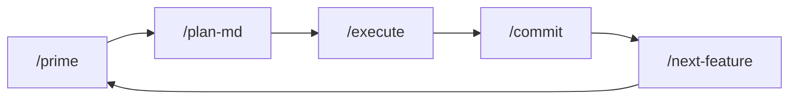

# Project Structure

AI IDE agent command set for feature-driven development workflows.

## Directory Layout

```
rules/
├── commands/           # Slash command definitions (.md prompts)
│   ├── autopilot.md    # Autonomous feature cycle
│   ├── commit.md       # Archive plan, commit changes
│   ├── epic-init.md    # Initialize new epic with features
│   ├── execute.md      # Implement with baseline verification
│   ├── ticket-init.md  # Add single ticket to features.yaml
│   ├── next-feature.md # Select next ready feature
│   ├── plan-md.md      # Create implementation plan
│   ├── prime.md        # Context prime for task
│   ├── project-init.md # Scaffold new project
│   └── test-coverage.md
│
├── bin/                # CLI tools
│   ├── pv              # Portfolio & Feature Viewer TUI
│   ├── fv -> pv        # Symlink: project-level alias
│   └── install.sh      # Install pv/fv to ~/.local/bin
│
├── skills/             # Claude Code skill definitions
├── statusline/         # Claude Code statusline config
│
├── docs/
│   ├── history/        # Archived implementation plans
│   ├── plans/          # Active implementation plans
│   ├── STRUCTURE.md    # This file
│   └── PARALLEL_AGENTS.md
│
├── features.yaml       # This project's feature backlog
├── AGENTS.md           # Coding style & behavioral guidelines
├── README.md           # Usage documentation
├── sync-prompts.sh     # Deploy commands to ~/.claude, ~/.codex, ~/.cursor
└── setup-autopilot.sh  # Enable autopilot hooks in a project
```

## Core Concepts

### Feature-Driven Workflow

Projects track work in `features.yaml`:
```
[feature] → /plan-md → [plan.md] → /execute → /commit → [done]
```

Features have: id, status, epic, dependencies, priority, steps.

### Command Chain



### pv/fv TUI

Terminal dashboard for `features.yaml` visualization and editing:
- **pv**: Portfolio view - scans directory tree for all projects
- **fv**: Feature view - single project's features.yaml

Navigation: Portfolio → Project → Epic → Feature (4-level drill-down)

Modes:
- **Table view**: Default list-based navigation with sorting/filtering
- **Tree view**: Collapsible hierarchy with search (`/`) and zoom (`z`)
- **Edit mode**: Inline feature editing with field navigation and save (`w`)

## Key Files

| File | Purpose |
|------|---------|
| `features.yaml` | Feature backlog (sequence of feature objects) |
| `AGENTS.md` | Agent behavior rules, copied to project roots |
| `sync-prompts.sh` | Deploys commands to IDE agent directories |

## Design Patterns

- **Single-file tools**: `bin/pv` is self-contained Python (requires PyYAML)
- **Markdown prompts**: Commands are `.md` files loaded as system prompts
- **State in filenames**: `auth-001.md` = tracked feature, `DARK_MODE.md` = standalone
- **yq for YAML ops**: Avoid loading large features.yaml into context
