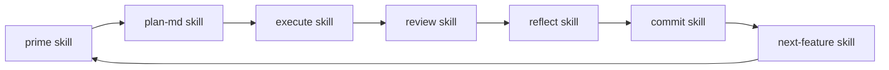

# Project Structure

AI IDE agent skills set for feature-driven development workflows.

## Directory Layout

```
rules/
├── bin/                # CLI tools
│   ├── pv              # Portfolio & Feature Viewer TUI
│   ├── fv -> pv        # Symlink: project-level alias
│   └── install.sh      # Install pv/fv to ~/.local/bin
│
├── experimental/
│   └── autopilot/      # Experimental Claude-only autopilot flow
│
├── skills/             # Canonical workflow skills
│   ├── _lib/           # Shared deterministic shell helpers
│   ├── commit/
│   ├── context-md/
│   ├── docs-health/
│   ├── epic-init/
│   ├── execute/
│   ├── explain-html/
│   ├── next-feature/
│   ├── plan-md/
│   ├── prime/
│   ├── project-init/
│   ├── reflect/
│   ├── review/
│   ├── test-coverage/
│   ├── ticket-init/
│   ├── workflow-migrate/
│   └── workflow-orchestrator/
├── agents/             # Shared reviewer subagents synced to supported harnesses
├── extensions/         # Pi-only runtime extensions synced to ~/.pi/agent/extensions/
├── pi/                 # Pi-only prompt assets
│   ├── agents/         # Pi-only subagents synced to ~/.pi/agent/agents/
│   └── skills/         # Pi-only skills synced to ~/.pi/agent/skills/
├── statusline/         # Claude Code statusline config
│
├── agent-work/         # Agent-produced workflow artifacts
│   ├── features.yaml   # This project's feature backlog
│   ├── plans/          # Active implementation plans
│   ├── history/        # Archived implementation plans and workflow notes
│   ├── tickets/        # Sparse ticket-local evidence/reproduction artifacts
│   ├── decks/          # Generated HTML presentation/explainer artifacts
│   └── <name>/         # Optional repo-specific non-durable planning/scratchpad areas
│
├── docs/
│   └── STRUCTURE.md    # Durable architecture/onboarding guide
│
├── pytest.ini          # Pytest collection config (scopes default runs to tests/)
├── CONTEXT.md          # Project purpose, audience, stage, assumptions, and terminology
├── AGENTS.md           # Coding style & behavioral guidelines
├── README.md           # Usage documentation
└── sync-prompts.sh     # Leave Codex unprompted; deploy workflow skills to Claude/Cursor/Pi; deploy AGENTS.md/subagents/extensions to supported harnesses
```

## Core Concepts

### Feature-Driven Workflow

Projects track work in `agent-work/features.yaml`:
```
[pending feature] → plan-md → [agent-work/plans/id.md] → execute → [in_progress] → review → reflect → commit → [done]
```

Agent-produced workflow artifacts live under `agent-work/`, including repo-specific planning/scratchpad areas when needed. Keep `agent-work/tickets/` sparse: use it only for ticket-local evidence or reproduction assets that should survive the turn. Durable project context, architecture, onboarding, and reference documentation stays in root docs or `docs/`.

Durable documentation boundaries:
- `CONTEXT.md`: project purpose, target user, stage, operating assumptions, and shared terminology
- `AGENTS.md`: agent behavior rules and repo-specific working instructions
- `docs/STRUCTURE.md`: architecture, directory layout, implementation patterns, and onboarding
- `README.md`: usage documentation

Features have: id, status, epic, depends_on, priority, and optional planning references such as `plan_file` and `references`.

### Skill Chain


```mermaid
graph LR
    prime["prime skill"] --> plan["plan-md skill"]
    plan --> execute["execute skill"]
    execute --> review["review skill"]
    review --> reflect["reflect skill"]
    reflect --> commit["commit skill"]
    commit --> next["next-feature skill"]
    next --> prime
```

The main workflow excludes experimental autopilot and file-reservation prompts. Within the default workflow, `review` is the explicit implementation inspection point and `reflect` updates durable docs or agent guidance before commit. Successful workflow skills emit a short `Summary:` line plus handoff labels (`READY FOR PLAN`, `READY FOR EXECUTE`, `READY FOR REVIEW`, `READY FOR REFLECT`, `READY FOR COMMIT`, then `WORKFLOW COMPLETE`; tracked work also uses `READY FOR PRIME`). These labels indicate the next user-invoked step and do not advance the workflow without explicit user action; Pi's workflow indicator also offers a double `ctrl+shift+right` shortcut that runs the next workflow skill, or clears the indicator from `commit`, when the editor is empty and Pi is idle. `workflow-orchestrator` is the explicit opt-in exception for parent-gated automation with persistent subagents. Autopilot lives under `experimental/autopilot/` and is not part of `AGENTS.md`.

### pv/fv TUI

Terminal dashboard for `agent-work/features.yaml` visualization and editing:
- **pv**: Portfolio view - scans directory tree for canonical `agent-work/features.yaml` files
- **fv**: Feature view - current project's `agent-work/features.yaml`

Navigation: Portfolio → Project → Epic → Feature (4-level drill-down)

Modes:
- **Table view**: Default list-based navigation with sorting/filtering
- **Tree view**: Collapsible hierarchy with search (`/`) and zoom (`z`)
- **Edit mode**: Inline feature editing with field navigation and save (`w`)

## Key Files

| File | Purpose |
|------|---------|
| `agent-work/features.yaml` | Feature backlog (sequence of feature objects) |
| `pytest.ini` | Pytest collection scope for repo tests |
| `CONTEXT.md` | Project purpose, target user, stage, operating assumptions, and shared terminology |
| `AGENTS.md` | Agent behavior rules, copied to project roots |
| `sync-prompts.sh` | Leaves Codex unprompted and prunes repo-managed Codex assets, deploys workflow skills/subagents to Claude/Cursor/Pi, overlays Pi-only skills/subagents/extensions into Pi, and configures Pi to load its local skill root |

## Design Patterns

- **Single-file tools**: `bin/pv` is self-contained Python (requires PyYAML)
- **Skill-first workflows**: `skills/*/SKILL.md` defines the main behavior; scripts handle deterministic mutations. Workflow skills may include `metadata.thinkingLevel` for Pi's skill-thinking extension; other harnesses ignore it.
- **HTML explainers**: `skills/explain-html` creates self-contained technical explanations, choosing the format from the content (slide deck, long-form article, or single canvas). The bundled deck template is an optional scaffold and the component/pattern references apply to any layout; visual direction comes from the `frontend-designer` design pass.
- **Focused reviewer subagents**: `agents/*` contains reusable critics for plan, code, and documentation review; workflow skills invoke them only at the relevant checkpoint. These definitions target Codex/Pi model bridges (`model: openai-codex/gpt-5.5`, lowercase tool names); spawned from a Claude Code session they may execute no tools and return empty or unreliable output, so confirm the critic actually used tools or run the critique through a general-purpose agent with the criteria inlined.
- **Pi runtime stays additive**: Pi-specific behavior belongs in `extensions/` or `pi/` instead of patching Pi core or overloading shared skills. `pi/skills/*` is for Pi-only skill overlays such as `long-execute`, while shared `skills/*` stays portable.
- **Experimental prompts stay isolated**: autopilot lives under `experimental/autopilot/` and remains opt-in
- **State in filenames**: `auth-001.md` = tracked feature, `DARK_MODE.md` = standalone
- **Repo-local YAML helper**: `skills/_lib/features_yaml.sh` is the supported entrypoint for shared `agent-work/features.yaml` reads/writes, backed by `skills/_lib/features_yaml.py` via `uv`; use `register` for ticket creation so ID allocation and append happen together
- **Explicit migrations**: `skills/workflow-migrate` prepares legacy root/`docs/` workflow artifacts for planned migration into `agent-work/` without adding old-path fallback behavior
