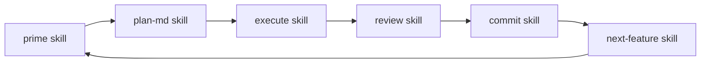

# Project Structure

AI IDE agent skills set for feature-driven development workflows.

## Directory Layout

```
rules/
├── bin/                # CLI tools
│   ├── pv              # Portfolio & Feature Viewer TUI
│   ├── fv -> pv        # Symlink: project-level alias
│   └── install.sh      # Install pv/fv to ~/.local/bin
│
├── experimental/
│   └── autopilot/      # Experimental Claude-only autopilot flow
│
├── skills/             # Canonical workflow skills
│   ├── _lib/           # Shared deterministic shell helpers
│   ├── commit/
│   ├── epic-init/
│   ├── execute/
│   ├── next-feature/
│   ├── plan-md/
│   ├── prime/
│   ├── project-init/
│   ├── review/
│   ├── test-coverage/
│   └── ticket-init/
├── extensions/         # Pi-only runtime extensions synced to ~/.pi/agent/extensions/
├── pi/                 # Pi-only prompt assets
│   └── agents/         # Pi-only subagents synced to ~/.pi/agent/agents/
├── statusline/         # Claude Code statusline config
│
├── docs/
│   ├── history/        # Archived implementation plans
│   ├── plans/          # Active implementation plans
│   ├── STRUCTURE.md    # This file
│   └── PARALLEL_AGENTS.md
│
├── features.yaml       # This project's feature backlog
├── pytest.ini          # Pytest collection config (scopes default runs to tests/)
├── AGENTS.md           # Coding style & behavioral guidelines
├── README.md           # Usage documentation
└── sync-prompts.sh     # Deploy shared assets to all harnesses and overlay Pi-only assets into Pi
```

## Core Concepts

### Feature-Driven Workflow

Projects track work in `features.yaml`:
```
[pending feature] → plan-md → [plan.md] → execute → [in_progress] → review → commit → [done]
```

Features have: id, status, epic, depends_on, priority, and optional planning references such as `plan_file` and `references`.

### Skill Chain


```mermaid
graph LR
    prime["prime skill"] --> plan["plan-md skill"]
    plan --> execute["execute skill"]
    execute --> review["review skill"]
    review --> commit["commit skill"]
    commit --> next["next-feature skill"]
    next --> prime
```

The main workflow excludes experimental autopilot and file-reservation prompts. Within the default workflow, `review` is the explicit pre-commit inspection point. Autopilot lives under `experimental/autopilot/` and is not part of `AGENTS.md`.

### pv/fv TUI

Terminal dashboard for `features.yaml` visualization and editing:
- **pv**: Portfolio view - scans directory tree for all projects
- **fv**: Feature view - single project's features.yaml

Navigation: Portfolio → Project → Epic → Feature (4-level drill-down)

Modes:
- **Table view**: Default list-based navigation with sorting/filtering
- **Tree view**: Collapsible hierarchy with search (`/`) and zoom (`z`)
- **Edit mode**: Inline feature editing with field navigation and save (`w`)

## Key Files

| File | Purpose |
|------|---------|
| `features.yaml` | Feature backlog (sequence of feature objects) |
| `pytest.ini` | Pytest collection scope for repo tests |
| `AGENTS.md` | Agent behavior rules, copied to project roots |
| `sync-prompts.sh` | Deploys shared subagents to all harnesses and overlays Pi-only subagents/extensions into Pi |

## Design Patterns

- **Single-file tools**: `bin/pv` is self-contained Python (requires PyYAML)
- **Skill-first workflows**: `skills/*/SKILL.md` defines the main behavior; scripts handle deterministic mutations
- **Pi runtime stays additive**: Pi-specific behavior belongs in `extensions/` or `pi/` instead of patching Pi core or overloading shared skills
- **Experimental prompts stay isolated**: autopilot lives under `experimental/autopilot/` and remains opt-in
- **State in filenames**: `auth-001.md` = tracked feature, `DARK_MODE.md` = standalone
- **Repo-local YAML helper**: `skills/_lib/features_yaml.sh` is the supported entrypoint for shared `features.yaml` reads/writes, backed by `skills/_lib/features_yaml.py` via `uv`
