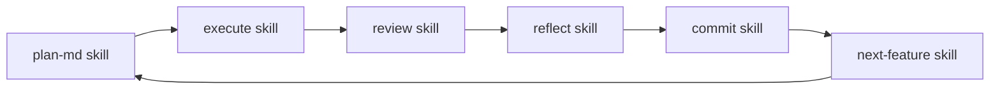

# Project Structure

AI IDE agent skills set for feature-driven development workflows.

## Directory Layout

```
rules/
├── bin/                # CLI tools
│   ├── pv              # Portfolio & Feature Viewer TUI
│   ├── fv -> pv        # Symlink: project-level alias
│   └── install.sh      # Install pv/fv to ~/.local/bin
│
├── experimental/
│   └── autopilot/      # Experimental Claude-only autopilot flow
│
├── skills/             # Canonical workflow skills
│   ├── _lib/           # Shared deterministic shell helpers
│   ├── commit/
│   ├── context-md/
│   ├── docs-health/
│   ├── epic-init/
│   ├── execute/
│   ├── answer-style/
│   ├── explain-html/
│   ├── next-feature/
│   ├── plan-md/
│   ├── project-init/
│   ├── reflect/
│   ├── review/
│   ├── test-coverage/
│   ├── ticket-init/
│   ├── workflow-orchestrator/
│   └── write-pr/
├── agents/             # Shared reviewer subagents synced to supported harnesses
├── extensions/         # Pi-only runtime extensions synced to ~/.pi/agent/extensions/
├── pi/                 # Pi-only prompt assets
│   ├── agents/         # Pi-only subagents synced to ~/.pi/agent/agents/
│   └── skills/         # Pi-only skills synced to ~/.pi/agent/skills/
├── statusline/         # Claude Code statusline config
│
├── agent-work/         # Agent-produced workflow artifacts
│   ├── features.yaml   # This project's feature backlog
│   ├── plans/          # Active implementation plans
│   ├── history/        # Archived implementation plans and workflow notes
│   ├── tickets/        # Sparse ticket-local evidence/reproduction artifacts
│   ├── decks/          # Generated HTML presentation/explainer artifacts
│   └── <name>/         # Optional repo-specific non-durable planning/scratchpad areas
│
├── docs/
│   └── STRUCTURE.md    # Durable architecture/onboarding guide
│
├── tests/              # Pytest + node tests for helpers, sync, and Pi runtime
│
├── pytest.ini          # Pytest collection config (scopes default runs to tests/)
├── CONTEXT.md          # Project purpose, audience, stage, assumptions, and terminology
├── AGENTS.md           # Coding style & behavioral guidelines
├── PRINCIPLES.md       # Distilled principles for working with coding agents
├── README.md           # Usage documentation
└── sync-prompts.sh     # Deploys prompts/skills/extensions to harness roots (see README Setup)
```

## Core Concepts

### Feature-Driven Workflow

Projects track work in `agent-work/features.yaml`:
```
[pending feature] → plan-md → [agent-work/plans/id.md] → execute → [in_progress] → review → reflect → commit → [done]
```

Agent-produced workflow artifacts live under `agent-work/`, including repo-specific planning/scratchpad areas when needed. Keep `agent-work/tickets/` sparse: use it only for ticket-local evidence or reproduction assets that should survive the turn. Durable project context, architecture, onboarding, and reference documentation stays in root docs or `docs/`.

Durable documentation boundaries:
- `CONTEXT.md`: project purpose, target user, stage, operating assumptions, and shared terminology
- `AGENTS.md`: agent behavior rules and repo-specific working instructions
- `docs/STRUCTURE.md`: architecture, directory layout, implementation patterns, and onboarding
- `README.md`: usage documentation

New features have canonical `id`, `status`, `title`, `subtitle`, `description`, `priority`, and `created_at` fields. The ID prefix replaces persisted `epic`. Meaningful dependencies and planning references remain optional. Markdown plans, not YAML `steps`, own detailed scope and checklists.

### Skill Chain


```mermaid
graph LR
    plan["plan-md skill"] --> execute["execute skill"]
    execute --> review["review skill"]
    review --> reflect["reflect skill"]
    reflect --> commit["commit skill"]
    commit --> next["next-feature skill"]
    next --> plan
```

The main workflow excludes experimental autopilot and file-reservation prompts. Within the default workflow, `review` is the explicit implementation inspection point and `reflect` updates durable docs or agent guidance before commit. Successful workflow skills emit a short `Summary:` line plus handoff labels (`READY FOR PLAN`, `READY FOR EXECUTE`, `READY FOR REVIEW`, `READY FOR REFLECT`, `READY FOR COMMIT`, then `WORKFLOW COMPLETE`). These labels indicate the next user-invoked step and do not advance the workflow without explicit user action. In Pi, `set_workflow_step(stepId)` lets the agent align the indicator with an already authorized step, including explicit chains and backward moves, without invoking a skill or granting permission to continue. It uses the existing step transition, preserves ticket identity, and ends focus on a changed step; selecting the current step is a no-op. Activities remain step-scoped and reject mismatches with an explicit switch instruction. After `/commit` completes every required repository commit and tracked feature/plan closeout, it calls Pi's Commit-only `complete_workflow` tool; this retains the terminal Commit activity and all-check rail, while failed or blocked closeout leaves Commit active. Pi's workflow indicator also offers a double `ctrl+shift+right` shortcut that runs the next workflow skill, or dismisses the completed indicator from `commit`, when the editor is empty and Pi is idle. `workflow-orchestrator` is the explicit opt-in exception for parent-gated automation with persistent subagents. Autopilot lives under `experimental/autopilot/` and is not part of `AGENTS.md`.

### pv/fv TUI

Terminal dashboard for `agent-work/features.yaml` visualization and editing:
- **pv**: Portfolio view - scans directory tree for canonical `agent-work/features.yaml` files
- **fv**: Feature view - current project's `agent-work/features.yaml`

Navigation: Portfolio → Project → Epic → Feature (4-level drill-down)

Modes:
- **Table view**: Default list-based navigation with sorting/filtering
- **Tree view**: Collapsible hierarchy with search (`/`) and zoom (`z`)
- **Edit mode**: Inline feature editing with field navigation and save (`w`)

## Key Files

| File | Purpose |
|------|---------|
| `agent-work/features.yaml` | Feature backlog (sequence of feature objects) |
| `pytest.ini` | Pytest collection scope for repo tests |
| `CONTEXT.md` | Project purpose, target user, stage, operating assumptions, and shared terminology |
| `AGENTS.md` | Agent behavior rules, copied to project roots |
| `sync-prompts.sh` | Deploys prompts/skills/extensions to harness roots (see README Setup) |

## Design Patterns

- **Single-file tools**: `bin/pv` is self-contained Python (requires PyYAML)
- **Skill-first workflows**: `skills/*/SKILL.md` defines the main behavior; scripts handle deterministic mutations. Optional heavyweight procedures live in per-skill `references/` files read only when that case arises (e.g. `workflow-orchestrator/references/parallel-worktrees.md`).
- **Manifest-based sync pruning**: `sync-prompts.sh` records relative file paths in per-directory `.rules-manifest-<category>` files. It removes stale tracked files and their empty parent directories while preserving local additions. Missing source directories count as empty. Legacy directory entries migrate using current source files; already-deleted nested files need one-time cleanup. Explicit `prune_and_record` seeds remove known legacy assets, including whole directories, so use them only when that deletion is intended.
- **HTML explainers**: `skills/explain-html` creates self-contained visual explanations with a format and design suited to the subject and audience. The skill covers source grounding, plain language, an unslop pass, and rendered validation without bundled templates or component libraries. Design and reader subagents are optional.
- **Shared subagents**: `agents/*` contains plan, code, and documentation critics plus frontend design and second-opinion specialists. Pi keeps their `openai-codex` or `claude-bridge` model settings. `sync-prompts.sh` drops those model settings, thinking, and Pi context fields from Claude and Cursor copies so they use default models, and maps lowercase tool names to native names.
- **Pi runtime stays additive**: Pi-specific behavior belongs in `extensions/` or `pi/` instead of patching Pi core or overloading shared skills. `pi/skills/*` is for Pi-only skill overlays, while shared `skills/*` stays portable. Focus uses the runtime tools rather than a skill.
- **One workflow runtime**: `extensions/workflow-runtime/index.ts` owns Pi lifecycle wiring, persisted workflow state, the positional rail, continuation delivery, native naming, ticket context, fixed activities, deterministic plan UI, and session metadata status. Earlier positions are checked even for direct out-of-order invocation; optional `currentStepComplete` changes only the current marker. Terminal Commit state survives reload until a new workflow/ticket or explicit clear replaces it. Exact Plan question and step-matched tmux critic starts automate observable activity transitions; defined tmux management actions never count as passes. Dependency-free transitions, completion, marker, and activity/pass rules stay in `core.ts`. `session-context.ts` owns bounded ticket/transcript/context contracts and selects an optional valid absolute `PI_AGENT_HUB_PRIMARY_CWD` for authored ticket/plan reads without persisting the path; `session-model.ts` owns Spark-first authenticated-model resolution, structured attempt diagnostics, and session-scoped unsupported-model suppression for naming and final-turn attention calls; `workflow-plan.ts`, `plan-widget.ts`, and `todo-panel.ts` own plan projection and Pi UI. Every `workflow-runtime` entry carries producer-owned steps plus optional activity/pass and bounded plan projection. A separate versioned `pi-agent-hub-context` entry publishes optional ticket subtitle/description and explicit human attention without duplicating the Pi-native title or coupling to Hub. Valid `ask_user_question` starts publish request-backed question attention immediately: `session-context.ts` hashes the exact tool call ID, bounds the first-question summary with an optional `+N more` suffix, and never copies option details. Matching completion clears only that request. Session boundaries supersede restored request-backed questions because their Pi questionnaire no longer exists, while ready, blocked, and requestless attention keep their existing resume behavior.
- **Hub compact-fork reset**: CLI `pi --fork` emits startup rather than a native fork boundary. An explicit `PI_AGENT_HUB_FORK_COMPACT=1` or a valid attempt token requests this reset. All participating extensions must capture the marker at registration and consume it only at session start so load order cannot hide it. Use the existing fork transition to clear inherited ticket/name ownership, workflow, and pending asynchronous work. Token-based callers receive a matching `workflow-runtime-reset` receipt only after cleared context and workflow entries are written; the boolean marker creates no receipt. The advertised capability is not proof of a completed reset. Resume restores the cleared state without repeating the reset; authored ticket/plan files remain untouched. Hub owns process startup and compaction; Rules owns the task reset.
- **Bounded semantic work**: Unnamed non-ticket sessions get one initial naming call; unlinked `/session-name refresh` uses the newest six bounded text messages. Keep ticket-name enforcement in the workflow runtime, including native name-change events, rather than relying on individual naming callers. Workflow stages must not rename the task. An explicit legacy ticket without an authored title uses its ticket ID until name generation succeeds, then retains the generated name while linked. Naming input combines the ticket ID, subtitle, description, and those recent messages within 3,000 code points; discard oldest complete messages first. Final attention runs once after a completed turn, accepts only explicit ready/question/blocked output at sufficient confidence, and clears before the next run. Both paths prefer `openai-codex/gpt-5.6-luna`, fall back only to `openai-codex/gpt-5.3-codex-spark`, request medium reasoning, allow five seconds per model, and never inspect tools, images, system prompts, or full plan tasks. After the API reports a model unsupported, the runtime skips it for the rest of that session. The active session model never performs metadata work. A badge beside the workflow rail distinguishes disabled, ready, running, authentication failure, and other failure states; without an active workflow, the badge remains in the same widget by itself. `/session-metadata-disable` stops optional naming and attention model calls for the current session, and `/session-metadata-enable` starts them again. Disabling invalidates in-flight results. `/session-metadata-status` reports the disabled state or detailed unsupported-model, timeout, provider, response, and parse outcomes. Parse failures include the expected contract, bounded rejected output, and retry guidance; only authentication failures recommend `/login openai-codex`.
- **Cache-safe focus delivery**: Dynamic focus guidance belongs in custom transcript messages, not `before_agent_start` system-prompt additions. Normal continuation uses a visible follow-up message; resumed input and overflow retry use hidden recovery messages. Keeping the system-prompt prefix stable preserves provider cache reuse while message metadata can still carry TUI-only turn progress.
- **Experimental prompts stay isolated**: autopilot lives under `experimental/autopilot/` and remains opt-in
- **State in filenames**: `auth-001.md` = tracked feature, `DARK_MODE.md` = standalone
- **Repo-local YAML helper**: `skills/_lib/features_yaml.sh` is the supported entrypoint for shared `agent-work/features.yaml` reads/writes, backed by `skills/_lib/features_yaml.py` via `uv`; use `register` for ticket creation so ID allocation and append happen together
- **Portable Rules worktrees**: `skills/_lib/worktrees.sh` wraps the dependency-free `worktrees.py`. Agent-owned worktrees live in unique task directories under absolute `AGENT_WORKTREES_DIR` (default `~/.local/share/agent-worktrees`). Each task has one durable external `worktree.json`; create/register/inspect/state/remove always address exact paths. Registration never scans or moves existing worktrees. Removal requires bounded artifact dispositions and uses ordinary verified Git removal without force, stash, broad deletion, or branch `-D`.
- **Independent worktree metadata**: workflow state persists only the exact Rules record reference. The runtime rereads that record and the ticket's current `plan_file` from its authoritative `authoredRoot`; a broken binding has no source-checkout fallback. It publishes an optional producer-neutral `pi-agent-hub-context.worktree` snapshot with `version`, `recordId`, `producer`, `revision`, `updatedAt`, and bounded repository source/worktree/branch/role/state/outcome/verification details. States are `active`, `awaiting-merge`, `cleanup-pending`, `check-needed`, and verified `cleaned`; a versioned `cleared` tombstone resets the producer projection. Ticket clear retains lifecycle, while ticket replacement, new/fork/full reset clear it. Workflow completion does not claim merge or cleanup.
- **Host/producer ownership boundary**: Rules remains fully usable without Hub. Hub can consume any valid producer snapshot but does not gain Git ownership or cleanup controls from it. Hub-owned worktrees remain under Hub operations and must not be duplicated in a Rules record. There is no shared registry, automatic synchronization, migration, or background scan.
