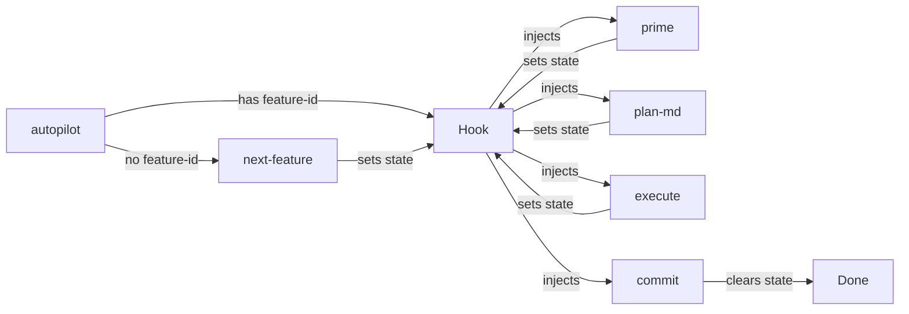

# Workflow Automation

Two modes: Manual (step-by-step) and Autopilot (hook-driven autonomous).

## Modes

### Manual Mode (Current)

User drives each step:

```
User: /prime auth-001
User: /plan-md auth-001
User: /execute
User: /commit
```

No hooks, no state. Unchanged.

### Autopilot Mode

Single command triggers hook-driven chain:

```
User: /autopilot auth-001
```



## How It Works

### The Loop

```
┌─────────────────────────────────────────────────────┐
│  1. Command runs, sets next step in state file      │
│  2. Command finishes                                │
│  3. Stop Hook fires, reads state                    │
│  4. Hook injects next command                       │
│  5. Claude executes next command                    │
│  6. Repeat until done or exception                  │
└─────────────────────────────────────────────────────┘
```

### State File

**`.claude/workflow.json`** (gitignored)

```json
{
  "feature": "auth-001",
  "next": "/plan-md"
}
```

- `feature`: Current feature ID (passed to commands that need it)
- `next`: Next command to run (null = done)

### Stop Hook

Reads state, tells Claude what to run next:

```bash
# If next is set → inject command
# If next is null → allow stop (done)
# If no state file → allow stop (manual mode)
```

## Architecture

```
.claude/
├── settings.json       # Hook registration
├── workflow.json       # Runtime state (gitignored)
└── scripts/
    └── workflow.sh     # Stop hook

commands/
├── autopilot.md        # NEW: Initializes state
├── prime.md            # Modified: sets next=/plan-md on completion
├── plan-md.md          # Modified: sets next=/execute on completion
├── execute.md          # Modified: sets next=/commit on completion
├── commit.md           # Modified: clears state on completion
└── next-feature.md     # Unchanged
```

## Implementation

### Phase 1: Hook Infrastructure
- [ ] Create `.claude/scripts/workflow.sh`
- [ ] Create `.claude/settings.json`
- [ ] Add `.claude/workflow.json` to `.gitignore`

### Phase 2: Commands
- [ ] Create `commands/autopilot.md`
- [ ] Add state transitions to existing commands

---

## Detailed Implementation

### 1. Stop Hook

**`.claude/scripts/workflow.sh`**

```bash
#!/bin/bash
STATE=".claude/workflow.json"

[[ ! -f "$STATE" ]] && exit 0

NEXT=$(jq -r '.next // empty' "$STATE")
FEATURE=$(jq -r '.feature // empty' "$STATE")

[[ -z "$NEXT" ]] && exit 0

# Build command with feature ID if needed
if [[ "$NEXT" == "/prime" || "$NEXT" == "/plan-md" ]]; then
  CMD="$NEXT $FEATURE"
else
  CMD="$NEXT"
fi

cat << EOF
{
  "decision": "block",
  "hookSpecificOutput": {
    "reason": "AUTOPILOT: Run $CMD"
  }
}
EOF
```

### 2. Hook Registration

**`.claude/settings.json`**

```json
{
  "hooks": {
    "Stop": [{
      "hooks": [{
        "type": "command",
        "command": "bash .claude/scripts/workflow.sh",
        "timeout": 5
      }]
    }]
  }
}
```

### 3. Autopilot Command

**`commands/autopilot.md`**

```markdown
---
argument-hint: [feature-id]
description: Run complete feature cycle autonomously.
---

Initialize autopilot workflow for feature: `$1`

If `$1` is blank, first run `/next-feature` to select one, then use that ID.

Write to `.claude/workflow.json`:
```json
{
  "feature": "<feature-id>",
  "next": "/prime"
}
```

Then output:
```
AUTOPILOT STARTED: <feature-id>
```

Do nothing else. The Stop hook will continue the workflow.
```

### 4. Command Modifications

Add to end of each command:

**`prime.md`** (append):
```markdown
---
If `.claude/workflow.json` exists, update it:
```bash
jq '.next = "/plan-md"' .claude/workflow.json > tmp.$$ && mv tmp.$$ .claude/workflow.json
```
```

**`plan-md.md`** (append):
```markdown
---
If `.claude/workflow.json` exists, update it:
```bash
jq '.next = "/execute"' .claude/workflow.json > tmp.$$ && mv tmp.$$ .claude/workflow.json
```

On exception (ambiguous requirements), clear workflow and report:
```bash
rm -f .claude/workflow.json
```
```
AUTOPILOT EXCEPTION: ambiguous_requirements
...
```
```

**`execute.md`** (append):
```markdown
---
If `.claude/workflow.json` exists, update it:
```bash
jq '.next = "/commit"' .claude/workflow.json > tmp.$$ && mv tmp.$$ .claude/workflow.json
```

On exception (baseline/tests/build fail), clear workflow and report:
```bash
rm -f .claude/workflow.json
```
```
AUTOPILOT EXCEPTION: <type>
...
```
```

**`commit.md`** (append):
```markdown
---
If `.claude/workflow.json` exists:
```bash
FEATURE=$(jq -r '.feature' .claude/workflow.json)
rm -f .claude/workflow.json
```
Output:
```
AUTOPILOT COMPLETE: $FEATURE
Committed: <hash>
```
```

---

## Exception Handling

Commands clear state and output exception format:

```
AUTOPILOT EXCEPTION: <type>

<what failed>

To resume: /autopilot <feature-id>
```

| Exception | Command | Trigger |
|-----------|---------|---------|
| `no_ready_features` | autopilot | No pending features |
| `ambiguous_requirements` | plan-md | Can't determine approach |
| `baseline_failed` | execute | Smoke test fails |
| `tests_failed` | execute | Tests fail after fix attempts |
| `build_failed` | execute | Build fails after fix attempts |
| `git_conflicts` | commit | Merge conflicts |

---

## Usage

### Happy Path
```
User: /autopilot auth-001

Claude: AUTOPILOT STARTED: auth-001

[Hook injects: /prime auth-001]
Claude: [reads context]

[Hook injects: /plan-md auth-001]
Claude: [creates plan]

[Hook injects: /execute]
Claude: [implements]

[Hook injects: /commit]
Claude: AUTOPILOT COMPLETE: auth-001
        Committed: abc123f
```

### Exception
```
User: /autopilot auth-001

Claude: AUTOPILOT STARTED: auth-001

[Hook injects: /prime auth-001]
Claude: [reads context]

[Hook injects: /plan-md auth-001]
Claude: [creates plan]

[Hook injects: /execute]
Claude: AUTOPILOT EXCEPTION: baseline_failed
        App won't start: missing dependency
        To resume: /autopilot auth-001

[No hook - state cleared]

User: [fixes dependency]
User: /autopilot auth-001

[Workflow restarts from /prime]
```

---

## Files

| File | Action |
|------|--------|
| `.claude/scripts/workflow.sh` | Create |
| `.claude/settings.json` | Create |
| `.gitignore` | Add `.claude/workflow.json` |
| `commands/autopilot.md` | Create |
| `commands/prime.md` | Append state transition |
| `commands/plan-md.md` | Append state transition |
| `commands/execute.md` | Append state transition |
| `commands/commit.md` | Append state transition |

---

## Testing

1. **Hook fires**: `/autopilot x` → hook injects `/prime x`
2. **Chain completes**: Full cycle runs without intervention
3. **Exception stops**: Break baseline → exception, no further hooks
4. **Manual unaffected**: Without workflow.json, commands work normally
5. **Resume works**: After exception fix, `/autopilot x` restarts
