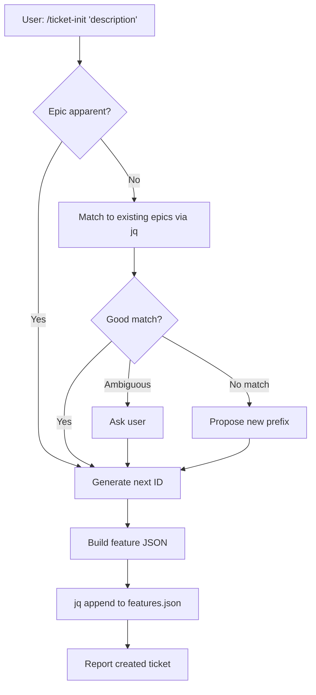

**Feature:** cmd-001 → ticket-init command for adding individual features to features.json

## Summary

Added `commands/ticket-init.md` — a lightweight command to add a single ticket to `features.json`, filling the gap between `/epic-init` (batch 4-10 features) and manual JSON editing.

## Design Decisions

- **Epic inference**: Agent matches description to existing epics semantically; asks only if ambiguous. No `--epic` flag — users mention epics naturally in the description.
- **Schema**: Matches full features.json schema (`title`, `description`, `epic`, `steps`, `priority`, `depends_on`, `discovered_from`, `spec_file`, `created_at`).
- **Description convention**: Rewritten into action-oriented format ("User can [action] with [context]"), consistent with `/epic-init`.
- **Steps**: Populated from user-provided implementation details, otherwise left empty.
- **Priority**: Defaults to `2` (core), agent adjusts if obvious from context.

## Comparison with epic-init

| Aspect | `/epic-init` | `/ticket-init` |
|--------|-------------|----------------|
| Input | Epic-level description | Single ticket description |
| Output | 4-10 features | 1 feature |
| Epic handling | Creates new epic | Appends to existing (or creates) |
| Decomposition | Yes | No |

## Data Flow

## Completed

- [x] `commands/ticket-init.md` created
- [x] `README.md` command table updated
- [x] `docs/STRUCTURE.md` directory layout updated
