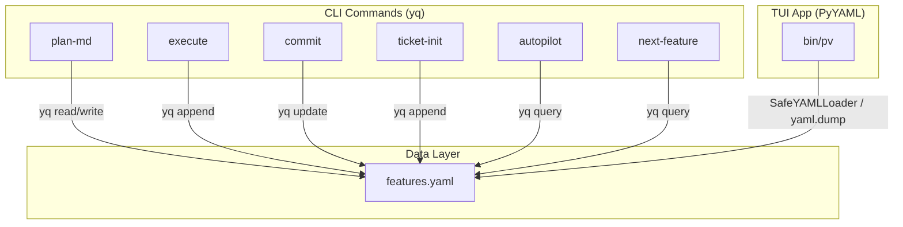

**Feature:** cmd-003 → Migrate features.json to features.yaml with yq

## Summary

Migrated all project backlogs from `features.json` (jq) to `features.yaml` (yq). Cross-cutting change touching 16 files across commands, the pv TUI app, documentation, and agent guidelines.

## Changes

### bin/pv (TUI App)
- Added PyYAML with `SafeYAMLLoader` to prevent date coercion (`created_at: 2026-01-15` stays `str`)
- `BACKLOG_FILE = 'features.yaml'` constant replaces all hardcoded paths
- `yaml.load()`/`yaml.dump()` replaces `json.load()`/`json.dump()`
- Fixed pre-existing bug: `if val:` → `if val is not None:` in `save_features()` (was dropping `[]`, `0`, `""`)
- CLI accepts `.yaml`, `.yml`, `.json` file args

### Command Prompts (8 files)
- All `jq` feature queries → `yq` equivalents
- Key translations: `all()` → `all_c()`, `any()` → `any_c()`, `index()` → `any_c(. == $val)`, `tonumber` → `to_number`, `--arg` → `env(VAR)`, `> tmp && mv` → `yq -i`
- All prose/frontmatter references updated

### Documentation
- `AGENTS.md`: `<features_json_operations>` → `<features_yaml_operations>` with yq patterns
- `docs/STRUCTURE.md`, `README.md`, `bin/install.sh`, `docs/PARALLEL_AGENTS.md`: all references updated

### Migration Script
- `bin/migrate-features`: Python script for JSON→YAML conversion
- Supports single-file, `--scan` directory tree, `--delete` option
- Roundtrip validation with `SafeYAMLLoader` (consistent date handling)
- Preserves field order via canonical ordering

## Architecture

## yq Gotchas

| jq | yq v4 | Notes |
|----|--------|-------|
| `all(cond)` | `all_c(cond)` | Conditional variants |
| `any(cond)` | `any_c(cond)` | Conditional variants |
| `$arr \| index($val)` | `$arr \| any_c(. == $val)` | No `index()` in yq |
| `tonumber` | `to_number` | Different name |
| `--arg name val` | `NAME=val yq '... env(NAME)'` | No `--arg` support |
| `> tmp && mv tmp f` | `yq -i '...' f` | Native in-place |
