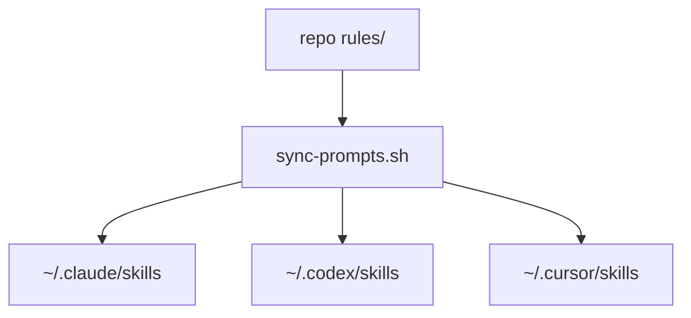

**Feature:** cmd-004 -> Migrate custom commands to skills with a cross-provider frontmatter contract (Claude-first)

## Objective

Define and execute a safe migration from `commands/*.md` to `skills/*/SKILL.md`, then retire command files in this repo, while keeping workflow behavior intact and standardizing metadata so behavior is predictable across Claude Code, Codex, and Cursor.

## Scope

In scope:
- Analyze every current custom command and classify migration strategy.
- Define a frontmatter compatibility specification.
- Create migration architecture, phases, and verification plan.
- Specify how `sync-prompts.sh`, docs, and workflows change.

Out of scope:
- Full implementation of all skills in this plan artifact.
- Redesign of feature workflow semantics.
- New workflow features unrelated to migration.

## Why This Change

- Codex now prefers/deprecates custom prompts in favor of skills.
- Claude Code unifies slash commands and skills semantics.
- Current repo is command-first and skill-empty, which creates maintenance drift risk.
- Single source of truth should move to skills to reduce duplication.

## Success Criteria

- Every command has an explicit migration decision: migrate to skill, then retire command.
- A frontmatter spec exists with canonical and provider-specific keys.
- A deterministic translation procedure exists for future commands.
- Repo ends in skills-only state with no maintained command layer.
- Documentation explains how contributors add new behavior post-migration.

## Context Files

### Core
- `commands/autopilot.md`
- `commands/commit.md`
- `commands/epic-init.md`
- `commands/execute.md`
- `commands/next-feature.md`
- `commands/plan-md.md`
- `commands/prime.md`
- `commands/project-init.md`
- `commands/test-coverage.md`
- `commands/ticket-init.md`
- `sync-prompts.sh`
- `features.yaml`

### Reference
- `AGENTS.md`
- `README.md`
- `docs/STRUCTURE.md`
- `docs/history/20260128_cmd-001_ticket_init.md`
- `docs/history/20260130_cmd-002_file_reservations.md`
- `docs/history/20260131_cmd-003_features_yaml.md`

### Config
- `.claude/settings.json` (if present in user env, not repo source-of-truth)
- Local agent directories affected by sync:
  - `~/.claude/commands`, `~/.claude/skills`
  - `~/.codex/prompts`, `~/.codex/skills`
  - `~/.cursor/commands`, `~/.cursor/skills`

## Alternatives Considered

### Option A: Keep command-first, add partial skill mirrors
Pros:
- Minimal immediate refactor.
- No short-term behavior risk.

Cons:
- Duplicated logic source.
- Divergence over time.
- Contradicts platform direction.

Decision: reject.

### Option B: Big-bang cutover to skills only
Pros:
- Clean architecture quickly.
- Fast convergence to target model.

Cons:
- Higher breakage risk.
- Harder rollback.
- More difficult contributor transition.

Decision: reject.

### Option C: Phased migration to skills-only (no wrappers)
Pros:
- Single source of truth in skills.
- Incremental rollout and rollback per command.
- Eliminates long-term duplication risk.

Cons:
- Slightly longer migration window.
- Existing command-only invocation habits must be updated.

Decision: adopt.

## Architectural Direction

### Source of Truth
- `skills/` becomes canonical behavior source.
- `commands/` is temporary migration input only and will be removed from the repo.

### Pattern
- Each workflow unit gets one skill folder:
  - `skills/<name>/SKILL.md`
  - optional `skills/<name>/scripts/*.sh`
  - optional `skills/<name>/references/*.md`

### Data/Control Flow


### Deployment Flow



## Per-Command Migration Analysis

### 1) `prime.md`
Current behavior:
- Reads `docs/STRUCTURE.md` and related files.
- Checks recent git history.
- Updates autopilot state to `/plan-md`.

Migration:
- Convert to `skills/prime/SKILL.md`.
- Move autopilot jq mutation into `skills/prime/scripts/advance_workflow.sh`.

Risk:
- Low. Primarily procedural text + one state transition.

### 2) `plan-md.md`
Current behavior:
- Generates detailed plans.
- Handles feature-id naming and auto-registration semantics.
- Optionally handles parallel reservation awareness.
- Sets tracked feature status to `in_progress`.
- Autopilot transition to `/execute`.

Migration:
- Convert to `skills/plan-md/SKILL.md`.
- Extract reusable helper scripts:
  - `skills/_lib/feature_id.sh`
  - `skills/_lib/workflow_state.sh`
- Keep policy text in SKILL; keep mutations scripted.

Risk:
- High. Most complex command; touches naming, state, and workflow handoff.

### 3) `execute.md`
Current behavior:
- Baseline verification.
- Implementation protocol.
- file-lock workflow.
- discovered work policy.
- optional functional testing guidance.
- autopilot transition to `/commit`.

Migration:
- Convert to `skills/execute/SKILL.md`.
- Extract lock protocol into `skills/_lib/file_lock.sh`.
- Keep discovered work rules in SKILL for human/agent reasoning.

Risk:
- High due to orchestration complexity.

### 4) `commit.md`
Current behavior:
- Review checklist.
- Archive plan document.
- Update `features.yaml` to done/completed/spec_file.
- release reservations.
- commit conventions.

Migration:
- Convert to `skills/commit/SKILL.md`.
- Extract archival naming logic into script helper.
- Keep commit-message policy in SKILL.

Risk:
- Medium-high; history integrity and final state correctness matter.

### 5) `next-feature.md`
Current behavior:
- Computes next ready feature by dependencies and priority.
- Outputs concise selection block.

Migration:
- Convert to `skills/next-feature/SKILL.md`.
- Keep query in reusable script `skills/_lib/select_next_feature.sh`.

Risk:
- Low-medium; deterministic selection must remain identical.

### 6) `ticket-init.md`
Current behavior:
- Determines epic.
- Generates next sequential ID.
- Appends one feature with defaults.

Migration:
- Convert to `skills/ticket-init/SKILL.md`.
- Reuse ID-generation library script.

Risk:
- Medium; ID collisions and schema mismatches are key failure modes.

### 7) `epic-init.md`
Current behavior:
- Decomposes epic into 4-10 atomic features.
- Creates `{epic}-000.md` context doc.
- appends features.

Migration:
- Convert to `skills/epic-init/SKILL.md`.
- Add deterministic template for generated `-000.md`.

Risk:
- Medium; mostly planning quality + schema discipline.

### 8) `project-init.md`
Current behavior:
- Scaffolds new project and starter docs.
- Creates empty `features.yaml`.
- initial commit guidance.

Migration:
- Convert to `skills/project-init/SKILL.md`.
- Script minimal scaffolding checks only; keep stack-selection logic textual.

Risk:
- Medium due to broad environment variability.

### 9) `autopilot.md`
Current behavior:
- Parses single vs continuous mode.
- picks feature(s).
- writes `.claude/workflow.json`.
- marked Claude-only path.

Migration:
- Convert to `skills/autopilot/SKILL.md`.
- Isolate provider-specific behavior in dedicated section + script.
- Keep explicit unsupported messaging for non-Claude contexts.

Risk:
- High. Provider-specific hooks + state machine semantics.

### 10) `test-coverage.md`
Current behavior:
- Audits test infrastructure.
- maps critical paths and gaps.
- proposes tests, then implements after confirmation.

Migration:
- Convert to `skills/test-coverage/SKILL.md`.
- Optional helper script for test-file inventory.

Risk:
- Low-medium.

## Frontmatter Compatibility Specification (Claude-First)

## Goals

- Preserve Claude behavior first.
- Avoid breaking Codex/Cursor when keys are unknown.
- Make metadata machine-readable and stable.

## Strategy

- Canonical portable keys at top-level frontmatter.
- Provider-specific keys optional and additive.
- Unknown keys must be ignored by providers that do not support them.

## Canonical Frontmatter Keys

```yaml
---
name: plan-md
summary: Create and maintain a markdown implementation plan.
argument_hint: "[request]"
category: workflow
providers:
  claude:
    command: "/plan-md"
  codex:
    command: "/plan-md"
  cursor:
    command: "/plan-md"
execution:
  model_intent: inherit
  deterministic_ops: true
  mutates_files: true
  requires_confirmation: false
compat:
  min_versions:
    claude_code: "latest"
    codex: ">=2026-01-22"
x-rules-source: skills/plan-md/SKILL.md
x-rules-owner: cmd-004
---
```

Notes:
- `name`, `summary`, `argument_hint`, `category`, `providers`, `execution`, `compat` are canonical portable metadata.
- `x-rules-*` is reserved for repo-local policy extensions.

## Provider-Specific Mapping

### Claude mapping
- Existing: `description`, `argument-hint`, `model`, `disable-model-invocation`.
- Migration approach:
  - keep Claude-native keys where required.
  - derive from canonical fields during sync if needed.

### Codex mapping
- Prefer skill metadata and `SKILL.md` behavior over legacy prompt frontmatter.
- no repo-local command metadata is required after migration.

### Cursor mapping
- Treat as a skill metadata consumer.
- Keep human-readable summary and argument hints in canonical metadata.

## Translation Rules

1. If a legacy key has direct canonical equivalent, map 1:1.
2. If legacy key is provider-only, store under `providers.<provider>.*`.
3. If key has no behavior impact, omit.
4. If ambiguous, prefer explicit canonical key and add one comment line in SKILL rationale.

## Frontmatter Example: Claude-First Skill Metadata

```yaml
---
# Canonical
name: execute
summary: Implement approved plan and verify outcomes.
argument_hint: ""
category: workflow
execution:
  model_intent: required
  deterministic_ops: mixed
  mutates_files: true

# Claude compatibility
description: Implement the approved plan.
disable-model-invocation: false

# Optional provider map
providers:
  claude:
    command: "/execute"
  codex:
    command: "/execute"
  cursor:
    command: "/execute"
---
```

## Directory Target State

```text
skills/
  _lib/
    feature_id.sh
    workflow_state.sh
    file_lock.sh
    features_yaml.sh
  prime/
    SKILL.md
    scripts/advance_workflow.sh
  plan-md/
    SKILL.md
    scripts/register_feature.sh
    scripts/mark_in_progress.sh
  execute/
    SKILL.md
  commit/
    SKILL.md
    scripts/archive_plan.sh
    scripts/mark_done.sh
  next-feature/
    SKILL.md
    scripts/select_next_feature.sh
  ticket-init/
    SKILL.md
    scripts/create_ticket.sh
  epic-init/
    SKILL.md
  project-init/
    SKILL.md
  autopilot/
    SKILL.md
    scripts/start_workflow.sh
  test-coverage/
    SKILL.md
```

## Auxiliary Script Decisions

Decision rule:
- Script when logic is deterministic, mutates state, and is reused or high-risk.
- Keep in `SKILL.md` when logic is judgment-heavy, one-off, or trivial.

| Candidate | Decision | Why | Trigger to Revisit |
|---|---|---|---|
| `skills/_lib/workflow_state.sh` | Yes | Workflow transition logic repeats across multiple skills and is state-sensitive. | Never remove unless workflow transitions are fully eliminated. |
| `skills/_lib/select_next_feature.sh` | Yes | Same dependency/priority query used in `next-feature` and `autopilot`. | Revisit if selection logic diverges by workflow. |
| `skills/_lib/feature_id.sh` | Yes | ID generation is shared and easy to drift if duplicated. | Keep unless feature ID scheme is removed. |
| `skills/_lib/file_lock.sh` | Yes | Lock protocol is strict and failure-prone; centralizing reduces race-condition mistakes. | Revisit only if file reservations are retired. |
| `skills/_lib/features_yaml.sh` | Maybe (minimal only) | Useful only for small shared primitives; avoid generic abstraction layer. | Add only after 3+ repeated mutation snippets. |
| `skills/prime/scripts/advance_workflow.sh` | No (use `_lib/workflow_state.sh`) | Thin wrapper adds no value beyond shared helper. | Add only if `prime` needs unique transition behavior. |
| `skills/plan-md/scripts/register_feature.sh` | Yes | Multi-step mutation (ID + schema + write) benefits from deterministic script. | Keep unless plan registration flow is redesigned. |
| `skills/plan-md/scripts/mark_in_progress.sh` | No | Single straightforward `yq` mutation; low value as standalone script. | Add if used in 3+ skills. |
| `skills/commit/scripts/archive_plan.sh` | Yes | Archive naming/path logic is easy to break; correctness impacts traceability. | Keep unless archive flow is removed. |
| `skills/commit/scripts/mark_done.sh` | Yes | Multi-field status update should remain consistent and auditable. | Revisit if done-state fields are simplified. |
| `skills/ticket-init/scripts/create_ticket.sh` | Maybe | Useful if reused by discovered-work and other ticket creation paths. | Promote to Yes when reused by 2+ workflows. |
| `skills/autopilot/scripts/start_workflow.sh` | Yes | Highest-risk initialization/state-machine path; should be deterministic. | Keep unless autopilot is retired. |
| `skills/next-feature/scripts/select_next_feature.sh` | No (reuse `_lib/select_next_feature.sh`) | Per-skill duplicate script adds maintenance burden. | Add only for provider-specific divergence. |
| `skills/test-coverage` helper scripts | No (initially) | Mostly analysis/reporting, low deterministic mutation. | Add if repeated inventory logic appears. |
| `skills/project-init` helper scripts | No (initially) | High context variability; script adds little value early. | Add after repeated scaffolding drift or bug reports. |
| `skills/epic-init` template generator | Maybe (later) | Can help formatting consistency, but not required for first migration pass. | Promote when epic doc inconsistencies become frequent. |

Implementation guidance from this matrix:
- Build first: `workflow_state.sh`, `select_next_feature.sh`, `feature_id.sh`, `file_lock.sh`, `register_feature.sh`, `archive_plan.sh`, `mark_done.sh`, `start_workflow.sh`.
- Defer: `features_yaml.sh` (beyond minimal primitives), ticket/test/project/epic helper scripts unless reuse threshold is met.

## Implementation Phases

### Phase 0 - Baseline and safeguards

- [x] Capture current behavior snapshots for all 10 commands.
- [x] Define acceptance checks per command (input -> expected output/state).
- [x] Add a migration tracker table to `docs/STRUCTURE.md` or dedicated doc.

Verification:
- Command outputs and key file mutations are documented before any refactor.
- No behavior assumptions remain undocumented.

### Phase 1 - Frontmatter contract

- [x] Create `docs/skills-frontmatter-spec.md`.
- [x] Document canonical schema and provider mappings.
- [x] Add examples for: read-only command, mutating command, provider-gated command.
- [x] Define lint rules (manual checklist first; optional script later).

Verification:
- At least 3 sample headers validate against spec checklist.
- Claude-required fields remain present where needed.

### Phase 2 - Shared helper extraction

- [x] Build `_lib` scripts for feature ID, workflow transitions, lock handling.
- [x] Replace duplicated shell snippets in at least 3 migrated skills with helpers.
- [x] Ensure helpers are shellcheck-clean enough for team usage.

Verification:
- Same command scenarios produce same outputs before/after helper adoption.
- No helper introduces fallback/default behavior not previously present.

### Phase 3 - Migrate low/medium risk commands first

- [x] Migrate: `prime`, `next-feature`, `ticket-init`, `test-coverage`.
- [x] Sync and dry-run each migrated skill workflow once in each target provider environment available.

Verification:
- Deterministic outputs match baseline for reference scenarios.
- No behavior depends on repo-local command markdown.

### Phase 4 - Migrate complex orchestration commands

- [x] Migrate: `plan-md`, `execute`, `commit`, `autopilot`, `epic-init`, `project-init`.
- [x] Preserve autopilot state transitions and exception semantics exactly.
- [x] Validate file reservation semantics unchanged.

Verification:
- Simulated feature lifecycle (`next-feature -> plan-md -> execute -> commit`) succeeds.
- Autopilot mode transitions remain correct in Claude flow.

### Phase 5 - Sync and documentation finalization

- [x] Update `sync-prompts.sh` to treat skills as primary artifacts.
- [x] Remove repo command sync from `sync-prompts.sh`.
- [x] Remove `commands/*.md` from repo once parity checks pass. (deferred to follow-up by explicit request: do not edit prompts)
- [x] Update `README.md` and `docs/STRUCTURE.md` with new source-of-truth policy.
- [x] Add migration notes and command retirement decision.

Verification:
- Fresh setup using sync yields functional skills only.
- Contributor docs clearly state how to add/modify workflows.

## Detailed Task Breakdown

### A. Analyze and baseline each command

- Inputs:
  - arguments
  - required files
  - environmental assumptions
- Outputs:
  - user-visible text
  - changed files
  - git expectations
- Failure modes:
  - missing files
  - malformed yaml
  - unavailable provider features

Deliverable:
- `docs/plans/cmd-004-baseline.md` (or section inside this plan)

### B. Build translation template

Template sections for each migrated skill:
- Purpose
- Invocation patterns
- Required context files
- Deterministic operations (shell snippets/scripts)
- Guardrails and non-goals
- Verification checklist

Deliverable:
- `skills/_template/SKILL.md` (optional but recommended)

### C. Create command-to-skill mapping table

| Command | Skill Path | Command Removed After Migration | Complexity | Migration Order |
|---|---|---:|---|---:|
| `/prime` | `skills/prime/SKILL.md` | yes | low | 1 |
| `/next-feature` | `skills/next-feature/SKILL.md` | yes | low | 1 |
| `/ticket-init` | `skills/ticket-init/SKILL.md` | yes | medium | 1 |
| `/test-coverage` | `skills/test-coverage/SKILL.md` | yes | low | 1 |
| `/plan-md` | `skills/plan-md/SKILL.md` | yes | high | 2 |
| `/execute` | `skills/execute/SKILL.md` | yes | high | 2 |
| `/commit` | `skills/commit/SKILL.md` | yes | high | 2 |
| `/autopilot` | `skills/autopilot/SKILL.md` | yes | high | 2 |
| `/epic-init` | `skills/epic-init/SKILL.md` | yes | medium | 2 |
| `/project-init` | `skills/project-init/SKILL.md` | yes | medium | 2 |

### D. Update sync behavior

Implementation notes:
- Keep existing `sync_dir` usage.
- Ensure skills sync always on.
- Remove command sync from this repo once migration completion criteria pass.

Pseudo-change:

```bash
sync_dir "${repo_root}/skills/" "${codex_root}/skills/" "skills"
# command sync removed from repo
```

### E. Documentation updates

Required doc updates:
- `README.md`: explain skill-first authoring workflow.
- `docs/STRUCTURE.md`: set `skills/` as canonical workflow layer.
- New `docs/skills-frontmatter-spec.md`: normative metadata contract.
- Optional `docs/skills-migration.md`: timeline and command parity tracker.

## Verification Strategy

### Functional parity checks

For each migrated command, run one golden scenario:
- Given controlled inputs and repo state.
- Observe output text and mutated files.
- Compare against baseline expectations.

Pass condition:
- No regressions in required behavior.

### Schema checks

- Verify all new skill frontmatter includes required canonical keys.
- Verify Claude-specific keys exist where Claude behavior depends on them.

Pass condition:
- Frontmatter checklist passes for 100% migrated skills.

### Workflow checks

- End-to-end feature cycle using migrated components.
- Autopilot single-mode sanity check.

Pass condition:
- feature transitions and plan/archive files are consistent.

### Readability/maintainability checks

- Ensure scripts are small and named by behavior.
- Ensure `commands/` is absent from the repo at migration completion.

Pass condition:
- Logic lives in skills/scripts only.

## Risks and Mitigations

1. Risk: Provider metadata mismatch.
Mitigation: canonical schema + provider mapping table + sample fixtures.

2. Risk: Drift during transition.
Mitigation: migrate in phases with parity checks, then remove command source files immediately after parity pass.

3. Risk: Autopilot regression.
Mitigation: isolate state transitions in tested helper scripts.

4. Risk: Contributor confusion.
Mitigation: update docs + contributor checklist + examples.

## Rollout Strategy

- Milestone 1: frontmatter spec approved.
- Milestone 2: 4 low/medium commands migrated.
- Milestone 3: orchestration commands migrated.
- Milestone 4: docs/sync finalized and command files removed from repo.
- Milestone 5 (future): periodic verification that new workflows are authored as skills only.

## Deliverables

- `docs/plans/cmd-004.md` (this plan)
- `docs/skills-frontmatter-spec.md`
- `skills/*` migrated command equivalents
- updated `sync-prompts.sh`
- updated `README.md` and `docs/STRUCTURE.md`

## Open Questions

- Do we want a lightweight frontmatter lint script in this repo now or after initial migration?
- Should `autopilot` remain explicitly Claude-only or expose partial cross-provider behavior with guarded fallbacks?

## Implementation Readiness

- Requirements are clear enough to begin implementation.
- First concrete step after approval: create `docs/skills-frontmatter-spec.md` from this plan and migrate `prime` + `next-feature` as proving ground.
