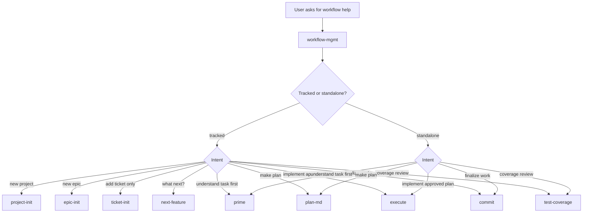

**Feature:** skill-005 → Package workflow skills behind a workflow-mgmt orchestrator

## Objective

Design a new `workflow-mgmt` skill that gives users one entrypoint for the repo's feature workflow, while preserving the current atomic skills as the canonical implementation units.

The goal is not to collapse `prime`, `plan-md`, `execute`, `commit`, `next-feature`, `ticket-init`, `epic-init`, and `project-init` into one giant prompt. The goal is to package them behind a thin orchestration layer that:

- routes the request to the right existing workflow unit
- teaches the model the lifecycle at a glance
- reduces user memorization of skill names
- keeps deterministic logic in shared helpers and existing scripts
- avoids re-copying the current skill bodies into another skill

## Scope

In scope:

- define the architecture of a new `skills/workflow-mgmt/` skill
- decide what should stay in existing skills vs what moves into the orchestrator
- define trigger phrases and request classification rules
- define the minimal bundled references and optional scripts for orchestration
- specify repo/documentation changes needed for rollout
- define verification for prompt routing and workflow correctness

Out of scope:

- replacing the existing atomic skills
- changing feature lifecycle semantics (`pending -> in_progress -> done`)
- redesigning autopilot or file-lock behavior
- adding a provider-specific runtime framework
- broad skill metadata standardization beyond what this new skill needs

## Why This Exists

The repo is already skill-first, but the workflow is still distributed across several named entrypoints. That is correct for maintenance, but it is not optimal for invocation ergonomics.

Users currently need to remember when to reach for:

- `project-init`
- `epic-init`
- `next-feature`
- `prime`
- `plan-md`
- `execute`
- `commit`
- `ticket-init`
- `test-coverage`

The `skill-creator` guidance argues for concise, composable skills with progressive disclosure. The efficient packaging pattern here is therefore:

1. keep the atomic skills intact
2. add one orchestration skill with very lean routing instructions
3. push detail into references only where the orchestrator truly needs workflow summaries
4. reuse existing `_lib` and skill-local scripts instead of inventing a second workflow engine

## Concrete Usage Examples

These are the kinds of requests that should trigger `workflow-mgmt`:

- "Help me start the next tracked feature in this repo."
- "I have an approved plan, move this through implementation and commit."
- "I want to add a new feature to the backlog and then plan it."
- "Initialize the workflow for a new project."
- "What step of the workflow should I run next?"
- "I have a feature ID, take me through the right workflow."
- "Manage this repo's feature workflow for me."

These requests should still end up delegating to existing skills or their documented contracts rather than re-implementing them inline.

## Context Files

### Core

- `skills/prime/SKILL.md`
- `skills/next-feature/SKILL.md`
- `skills/plan-md/SKILL.md`
- `skills/execute/SKILL.md`
- `skills/commit/SKILL.md`
- `skills/ticket-init/SKILL.md`
- `skills/epic-init/SKILL.md`
- `skills/project-init/SKILL.md`
- `skills/_lib/features_yaml.sh`
- `sync-prompts.sh`

### Reference

- `docs/STRUCTURE.md`
- `README.md`
- `docs/history/20260218_cmd-004_skills_frontmatter_contract.md`
- `docs/history/20260302_skill-001_extract_workflow_filelock.md`
- `docs/history/20260307_skill-002_workflow_cleanup.md`

### Config

- `features.yaml`
- local synced skill trees under `~/.codex/skills`, `~/.claude/skills`, `~/.cursor/skills`

## Existing Constraints

- `skills/*/SKILL.md` files are already the canonical workflow surface.
- Shared deterministic behavior now lives in `skills/_lib`, including `features_yaml.py`.
- `sync-prompts.sh` already syncs any new skill folder under `skills/` to all harnesses.
- The repo explicitly prefers minimalism and discourages wrapper bloat.
- The design should follow the local summary of `skill-creator` principles: keep the orchestrator concise, use progressive disclosure, and avoid duplicating child skill bodies when references or handoff rules are enough.

## Alternatives

### Option A: Merge all workflow skill bodies into one giant `workflow-mgmt/SKILL.md`

Pros:

- One obvious entrypoint
- Fewer visible skill names

Cons:

- Massive duplication of instructions already owned elsewhere
- High drift risk whenever an atomic skill changes
- Poor context efficiency
- Harder to keep trigger semantics precise

Decision: reject.

### Option B: Replace the atomic skills with a single new workflow skill

Pros:

- Superficially simpler repo surface

Cons:

- Removes the modular units that currently map cleanly to the lifecycle
- Increases maintenance risk for deterministic workflow segments
- Makes future specialization harder
- Works against the existing skill architecture documented in this repo

Decision: reject.

### Option C: Add a thin orchestration skill that routes into existing skills

Pros:

- Best invocation ergonomics
- No duplication of deterministic logic
- Keeps current workflow contracts intact
- Easy to evolve incrementally

Cons:

- Adds one more skill folder
- Requires careful wording so it orchestrates rather than competes

Decision: adopt.

### Option D: Add only README docs and no new skill

Pros:

- Minimal repo change

Cons:

- Does not improve triggerability
- Leaves the model without a dedicated "workflow entry" abstraction
- Pushes burden back onto the user

Decision: reject.

## Proposed Architecture

### High-Level Shape

Add a new folder:

```text
skills/workflow-mgmt/
├── SKILL.md
├── references/
│   ├── routing.md
│   └── lifecycle.md
```

The orchestrator should stay thin. It should not own the real implementation details of planning, ticket creation, execution, or commit behavior.

### Ownership Boundaries

`workflow-mgmt` owns:

- request classification
- choosing which existing skill or skill sequence applies
- giving the model a compact map of the lifecycle

Existing skills continue to own:

- exact feature selection semantics: `next-feature`
- ticket creation semantics: `ticket-init`
- planning contract: `plan-md`
- lifecycle activation and discovered-work policy: `execute`
- archive/done semantics: `commit`
- project and epic bootstrapping: `project-init`, `epic-init`

Shared helpers continue to own:

- deterministic file/YAML mutations under `skills/_lib`

`workflow-mgmt` explicitly does not own:

- autopilot entry or transitions
- experimental file-lock coordination
- reimplementation of child skill instructions
- second-control-plane scripts for v1

### Proposed Request Router



### Trigger Contract

The new skill description should target phrases about workflow coordination, not specific implementation tasks. It should trigger for:

- feature lifecycle guidance
- workflow routing
- choosing the next step
- managing tracked work
- moving work from backlog to plan to implementation to commit

It should not trigger instead of `execute` for direct implementation requests unless the user is clearly asking for workflow management rather than code changes.

Before routing by phase, the orchestrator should first decide whether the repo context is tracked-work or standalone-work:

- If `features.yaml` exists and the request is about backlog-managed work, treat it as tracked workflow.
- Otherwise treat it as standalone workflow and never send "what next?" requests to `next-feature`.
- Do not infer experimental autopilot or file-lock mode from this skill; those remain opt-in only.

### Progressive Disclosure Plan

#### `SKILL.md`

Keep it short and procedural:

- when to use the skill
- how to determine tracked vs standalone mode
- how to classify the request
- which existing skill(s) to consult next
- when to read `references/routing.md`
- when to read `references/lifecycle.md`
- explicit instruction not to duplicate or override the downstream skill contracts
- explicit instruction to open `skills/<name>/SKILL.md` and follow it as authoritative once a route is chosen

#### `references/routing.md`

Contain a concise routing table:

- tracked vs standalone precondition
- request shape
- downstream skill
- handoff rule to the downstream skill
- required prerequisites
- resulting artifact/state changes
- allowed multi-step sequences only when the user explicitly asks for multiple phases

#### `references/lifecycle.md`

Contain one compact lifecycle guide:

- tracked vs standalone work
- who owns `pending -> in_progress`
- when `plan_file` is active vs archived
- when to use `next-feature` vs `ticket-init`
- default workflow only; experimental autopilot/file-lock flows excluded unless explicitly requested

## Recommended Skill Contract

The orchestrator should follow these rules:

1. Start by identifying whether the repo context is tracked-work or standalone-work.
2. Then identify whether the user wants project setup, backlog creation, planning, execution, commit, or "what next?"
3. If the request maps cleanly to one atomic skill, open `skills/<name>/SKILL.md` and follow it as the authoritative downstream contract.
4. If the user explicitly asks for multiple phases, allow only explicit sequences such as `next-feature -> prime -> plan-md`, `ticket-init -> plan-md`, or `execute -> commit`.
5. If the user asks for only one phase, do not broaden scope into adjacent phases.
6. Treat the downstream skill as canonical when there is any conflict.
7. Exclude `autopilot`, `skills/_lib/WORKFLOW.md`, and `skills/_lib/FILE_LOCK.md` from the default orchestrator unless the user explicitly opts into experimental flows.

## Concrete File Plan

### New files

- `skills/workflow-mgmt/SKILL.md`
- `skills/workflow-mgmt/references/routing.md`
- `skills/workflow-mgmt/references/lifecycle.md`

### Existing files likely touched

- `README.md`
- `docs/STRUCTURE.md`
- possibly `features.yaml` only for tracking this feature, not because the skill needs schema changes

### Files explicitly not changed in the first pass

- atomic skill semantics in `skills/prime`, `skills/plan-md`, `skills/execute`, `skills/commit`, etc.
- `skills/_lib/WORKFLOW.md`
- `skills/_lib/FILE_LOCK.md`
- `sync-prompts.sh` unless a packaging edge case is discovered
- `agents/openai.yaml` metadata for this skill in v1

## Draft SKILL Structure

```md
---
name: workflow-mgmt
description: Route workflow-management requests to the right feature lifecycle skill or sequence.
---

Use this skill when the user asks how to manage tracked work, what workflow step comes next, or wants one entrypoint for the feature lifecycle.

First determine whether the request is about tracked work (`features.yaml`, backlog, feature IDs, next tracked task) or standalone work.

Classify the request:
- New project -> use `project-init`
- New epic in tracked mode -> use `epic-init`
- New ticket only in tracked mode -> use `ticket-init`
- Next tracked item -> use `next-feature`
- Understand task before planning -> use `prime`
- Create or update a plan -> use `plan-md`
- Implement an approved plan -> use `execute`
- Finalize completed work -> use `commit`
- Assess tests -> use `test-coverage`

After selecting the downstream skill, open `skills/<name>/SKILL.md` and follow it as authoritative.

Only chain multiple downstream skills when the user explicitly asks for multiple phases, for example:
- "pick the next feature and plan it" -> `next-feature -> prime -> plan-md`
- "add this ticket and plan it" -> `ticket-init -> plan-md`
- "finish implementation and commit it" -> `execute -> commit`

Read `references/routing.md` if the request spans multiple phases or the next step is unclear.
Read `references/lifecycle.md` if you need the tracked-work lifecycle rules.

Do not re-implement child skill instructions here. The child skill remains canonical.
Do not invoke experimental autopilot or file-lock flows unless the user explicitly asks for them.
```

## Implementation Phases

### Phase 1: Define orchestration contract

- [ ] Finalize the user intents that should trigger `workflow-mgmt`
- [ ] Finalize the tracked-vs-standalone first decision
- [ ] Confirm the orchestrator is composition-first, not replacement-first
- [ ] Define the routing matrix from request category to downstream skill
- [ ] Define allowed multi-step sequences for explicit multi-phase requests
- [ ] Define conflict resolution rule: downstream skill wins
- [ ] Define default-workflow boundary: no autopilot or file-lock flows in v1

Verification:

- Can each common workflow request map to one primary skill or ordered sequence?
- Is there any duplicated lifecycle policy in the draft contract?
- Is the tracked-vs-standalone split unambiguous for "what next?" requests?

### Phase 2: Add the new skill skeleton

- [ ] Create `skills/workflow-mgmt/SKILL.md`
- [ ] Keep the SKILL body short and focused on classification/routing
- [ ] Create `references/routing.md`
- [ ] Create `references/lifecycle.md`

Verification:

- The new skill can be read quickly without loading all workflow docs
- The references are one level deep and directly linked from `SKILL.md`
- No reference file merely recopies an existing skill body

### Phase 3: Integrate the skill into repo docs

- [ ] Add `workflow-mgmt` to `README.md`
- [ ] Update `docs/STRUCTURE.md` skill inventory and workflow narrative
- [ ] Document that the orchestrator is an entrypoint over existing atomic skills, not a semantic replacement

Verification:

- A new contributor can understand when to invoke `workflow-mgmt` vs an atomic skill
- Docs still present the atomic workflow accurately

### Phase 4: Validate routing quality

- [ ] Dry-run representative prompts against the routing table
- [ ] Check that planning requests still end in `plan-md`
- [ ] Check that implementation requests still route to `execute`
- [ ] Check that tracked "what next?" requests route to `next-feature`
- [ ] Check that standalone "what next?" requests route to the current standalone phase instead of `next-feature`
- [ ] Check that bootstrapping requests route to `project-init` or `epic-init`
- [ ] Check that explicit multi-phase requests use only the approved chained sequences
- [ ] Check that the orchestrator never enters autopilot/file-lock flows unless explicitly requested

Verification:

- The orchestrator never expands a narrow request into the full lifecycle unless the user asked for it
- The orchestrator never contradicts downstream skill semantics

## Verification Strategy

### Behavioral checks

- Use sample prompts representing each lifecycle stage
- Confirm the chosen downstream skill matches the routing table
- Confirm no request triggers unnecessary multi-skill expansion

### Drift checks

- Compare `workflow-mgmt` routing statements against the live child skills
- Ensure lifecycle summaries match `skills/plan-md/SKILL.md`, `skills/execute/SKILL.md`, `skills/commit/SKILL.md`, and `skills/next-feature/SKILL.md`

### Packaging checks

- Run `./sync-prompts.sh --silent` and verify the new skill directory syncs to harness roots
- Verify reference paths remain valid after sync

### Minimal smoke checks

- Inspect the synced `workflow-mgmt/SKILL.md` under one harness root

## Risks

### Risk: Wrapper bloat

If `workflow-mgmt` starts copying child-skill instructions, it becomes a second source of truth.

Mitigation:

- keep `SKILL.md` routing-only
- move compact summaries to references
- treat downstream skills as authoritative

### Risk: Ambiguous trigger boundary

The orchestrator could trigger for direct implementation requests and interfere with `execute`.

Mitigation:

- tune the description toward workflow-management requests
- keep examples focused on routing and lifecycle, not implementation itself

### Risk: Wrapper turns into replacement logic

If `workflow-mgmt` starts owning transition behavior or hidden automation, it will drift from the atomic skills.

Mitigation:

- keep v1 documentation-only apart from the new skill and reference files
- require explicit handoff into downstream `SKILL.md` files
- exclude experimental flows from the default orchestrator contract

## Open Questions

- Should `workflow-mgmt` be purely a routing skill, or should it also support "multi-step workflow packs" such as `next-feature -> prime -> plan-md` when the user explicitly asks for end-to-end guidance?

## Recommended Initial Answer

Implement `workflow-mgmt` as a thin orchestration skill layered on top of the current atomic skills. Keep the existing skills as canonical. Ship v1 with only `SKILL.md` plus two small reference files, treat downstream skills as authoritative, and explicitly exclude autopilot and file-lock flows unless the user opts into those experimental paths.
