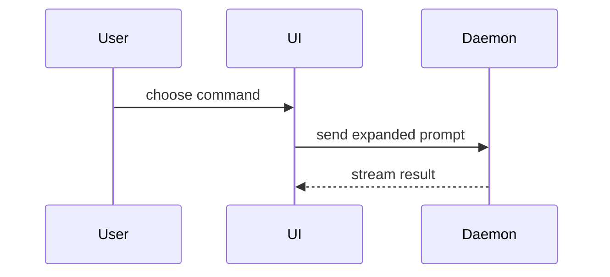

Title: one sentence, imperative, describing the objective. Body: bullets and visuals, no essays. Pick the smallest view that makes the key point clear.

Never mention intermediate history: only the squash-merge result matters, not that the diff shrank or that a commit was refactored away.

- Show logic or an algorithm as pseudocode:

```text
on(save)
  if content is unchanged
    return cached result
  write new content
  return fresh result
```

- Show runtime control flow as a call tree:

```text
submitForm
  createSession
    persistPrompt
    launchAgent
  navigateToSession
```

- Show UI structure as a component tree, including state and module boundaries that matter:

```tsx
<SessionPage> (apps/example/src/routes/session.tsx)
  useSessionEvents()
  <SessionToolbar>
    <RunSkillButton> (packages/ui)
```

- Show file responsibility or a broad refactor as a shallow file tree:

```text
src/
├── commands/       # parses user actions
├── sessions/       # owns session state
└── transport/      # sends API requests
```

- Show component interaction, control flow, or data flow with Mermaid:



- Use `diff` when the point is what changes and the surrounding shape already exists. Match the diff shape to the topic — file layout:

```diff
 src/
 ├── commands/
+│   └── show-me.ts       # expands the slash command
 ├── sessions/
-└── transport.ts
+└── transport/
+    ├── client.ts
+    └── stream.ts
```

State or control flow:

```diff
 on(save)
-  write content
+  if content is unchanged
+    return cached result
+  write new content
+  invalidate cache
```

- Show the whole block when most of it is new, when omitted context would hide ownership or order, or when the reader needs a copyable target shape:

```ts
function expandSkill(command: string): string {
  const skillName = command.slice(1)
  return `use the ${skillName} skill`
}
```

- For a change with visible UI effects, direct or indirect, show a before/after table with uploaded images or video. For benchmarks, always show a before/after table: baseline from the target branch, candidate from the PR.

## Guidance

Place each visual next to the short text it supports. Keep only the calls, files, props, states, and boundaries needed to explain the change. Code refs are welcome.

You may use one of these, you may use several, it is unlikely you will use all of them. Use your judgement and don't overwhelm the reader.

For a truly difficult, high-risk, or wide-scoped change, write the body like a technical blog post — context, storytelling, before/after, diagrams, images. Everything else stays terse.
